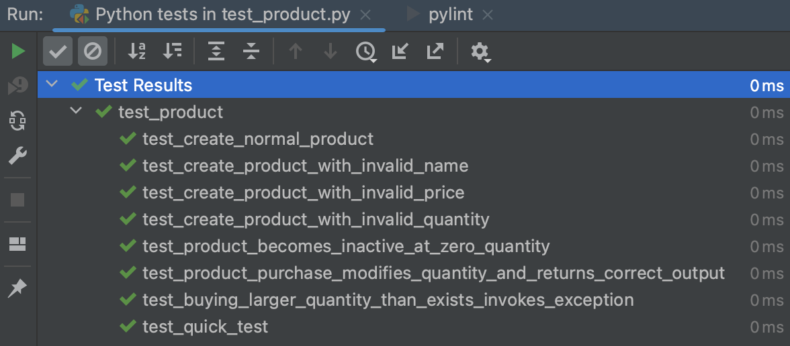

# BestBuy
Best Buy project manages store operations and product management.

Welcome to the BestBuy Store Application! This application allows users to manage and process orders for a variety of products.

## Getting Started

To get started with the BestBuy Store application, follow these steps:

1. Clone the repository from GitHub:

   ```shell
   git clone https://github.com/rsfsalman/bestbuy.git
   ```

2. Run the application:

   ```shell
   python3 main.py
   ```
   
## Features

The BestBuy Store application offers the following features:

* Browse products: View a list of available products with their prices, quantities, and promotions.
* Purchase products: Add products to the cart and specify the desired quantities for purchase.
* Apply promotions: Take advantage of various promotions available for eligible products.
* Generate order summaries: Obtain a summary of the completed order, including purchased products and total price.

## Usage
Upon running the application, you will be presented with a menu of options to interact with the store. Simply follow the prompts and instructions provided to navigate through the application and perform desired actions.

## Testing
The BestBuy Store application includes a comprehensive suite of tests to ensure its functionality and reliability. To run the tests and verify the application's integrity, execute the following command:

 ```shell
   python3 test_product.py
   ```
Once the tests have completed successfully, you can refer to the test_results.png file (located in the project's root directory) for a visual representation of the test results.




## Contributing
Contributions to the BestBuy Store project are welcome! If you find any issues or have suggestions for improvements, please create an issue on the [GitHub repository](https://github.com/rsfsalman/bestbuy/issues).

## Contact
For any inquiries or further information, please feel free to reach out to me:

GitHub: [rsfsalman](https://github.com/rsfsalman)